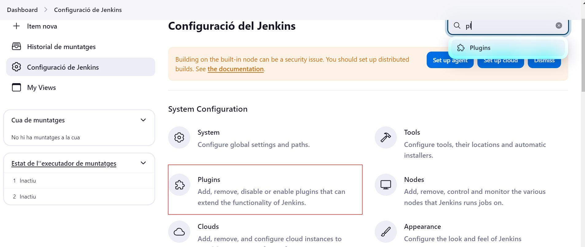
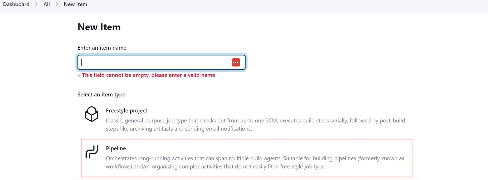
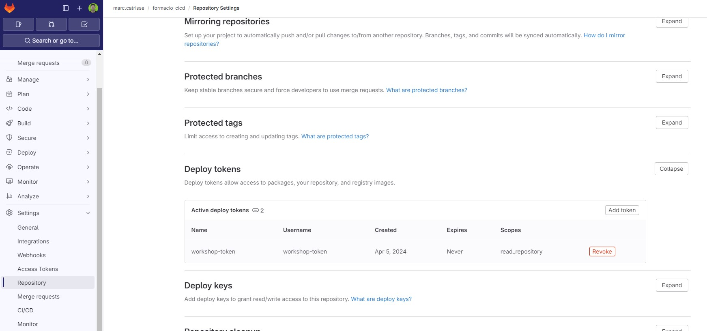

## Workshop CI/CD with jenkins

In this workshop, we'll learn how to set up a pipeline using Jenkins with Docker to automate the process of building and deploying a Python project.

## Prerequisites
Before you begin, make sure you have Docker installed:

- Docker: [Installation Instructions] (https://docs.docker.com/get-docker/)

## Paso 0 - Fork this repository

1. To get started, fork this repository in your GitLab account. 

2. The next step is to clone your repository to your local machine. To do this, run the following commands on your terminal:
    ```bash
    git clone https://<your-repository>/training-cicd.git
    cd training-cicd
    ```

3. Create a branch to work on in the workshop. For example, if you're working with Jenkins, create a branch called "jenkins":
    ```bash
    git checkout -b jenkins
    ```

## Step 1 - Configure Jenkins with Docker

This code sets up a Jenkins pipeline using Docker for a Python project.

To start Jenkins with Docker, follow these steps:

1. Launch the Jenkins container using Docker Compose:
    - Open a terminal or command line.
      ```bash
      docker compose up
      ```
    - This command does the following:
         - Start the Jenkins container and create a volume named "jenkins_home" to persist the Jenkins data.
         - Maps container ports 8080 and 50000 to host machine ports 8080 and 50000, respectively.
         - It also launches the docker:dind service to use Docker on Docker.

2. Accede a Jenkins:
    - Open a web browser and navigate to http://localhost:8080.
    - Follow the on-screen instructions to complete the Jenkins setup process.
    
    - Choose "Install suggested plugins" to install the default plugins.
    
    - Set up an admin user to access Jenkins.
    

3. Install the necessary plugins:
    - Once Jenkins is configured, log in with the credentials of the created admin user. 
    - Go to "Manage Jenkins" > "Plugins" > "Available Plugins" to install the necessary plugins.
    
    - Install the necessary plugins to create the pipeline of this Python project, such as:
      - Docker
      - Docker Pipeline
      - Warnings
      - Cobertura
    - You don't need to restart Jenkins after installing these plugins.

4. Restart the Jenkins service (OPTINAL POINT):
    - Open a terminal or command line.
      ```bash
      docker compose restart jenkins
      ```
    - This command restarts the Jenkins container with the plugins installed.
    - NOTE: This step should not be necessary, but otherwise it does not detect the "docker" agent.

That's all! You've now installed Jenkins with Docker.

## Step 2 - Configure Jenkins pipeline

In this step, we'll create a Jenkins pipeline to automate the process of building and deploying a Python project.

To create a Jenkins pipeline, follow these steps:

1. Create a new task:
    - Click on "New Task"/"Create a Job" in the Jenkins dashboard.
    - Enter a name for the task (e.g., "Workshop Pipeline") and select "Pipeline" as the task type.
    
    - Click "OK" to create the task.
    
2. Set up the pipeline:
    On the pipeline settings page, scroll down to the "Pipeline" section.
    - Select "Pipeline script from SCM" as the definition.
    - Choose "Git" as the SCM.
    - Enter your repository's GitHub repository URL (https).
    - Create a new credential with your Github repository.
    - Go to your GitHub account.
    - Click your GitHub repository.
    - Create you own key using: ssh-keygen -t ssh-rsacd
    - the new key is stored in:
        ~./ssh/id_rsa (private key)
        ~./ssh/id_rsa.pub (public key)
    - Go to a "Settings" > "Deploy Keys" > "Add deploy key". 
    - Add your public key
    - Create a new key, you don't need the permissions of: "Allow write accesses".
    
    - Agrega el token de implementación como una credencial en la configuración del pipeline.
    
    - Selecciona la credencial que creaste en el campo "Credentials".
    - Ingresa el nombre de la rama en la que estés trabajando (por ejemplo, "jenkins") en el campo "Branches to build".
    
    - Haz clic en "Save" para guardar la configuración del pipeline.

3. Run the pipeline:
    - Click "Build Now" to run the pipeline.
    - Jenkins will clone the repository, and execute the pipeline defined in the "Jenkinsfile" file, which includes the steps of:
      - Clean workspace: Cleans up the workspace before running the pipeline.
      - Build: Installs the dependencies of the Python project.
      - Deploy: space to configure the deployment of the python project.
    
    
    - You can view pipeline progress and logs in the Jenkins dashboard.

## Step 3 - Customize the Jenkins pipeline

In this step, we'll customize the Jenkins pipeline for a Python project.

1. Customize the pipeline:
    - Open the "Jenkinsfile" file in your favourite code editor, for example: Visual Studio Code.
2. Configure stage "Static Analysis":
    - This stage runs static code analysis with Pylint.
    - Copy the following text into the Pipeline:
      ```groovy
        // Static Analysis stage to run PyLint and publish report
        stage('Static Analysis') {
            steps {
                echo "Running PyLint"
                sh '''
                    . .venv/bin/activate
                    pylint -d C0301 -f parseable --reports=no main.py transform.py > pylint.log || echo "pylint exited with $?"
                '''
            }
            environment {
                PYLINTHOME = '.pylint.d'
            }
            post {
                always {
                    echo 'Publishing PyLint Report'
                    sh 'cat pylint.log'
                    recordIssues(
                        healthy: 1, 
                        tools: [pyLint(name: 'Python Project', pattern: '**/pylint.log')], 
                        unhealthy: 2
                    )
                }
            }
        }
      ```
    - Commit and push the changes in the "Jenkinsfile" file to your GitLab repository.
    - Verify that the pipeline is running correctly and that static code analysis is successful.
    - You can view the results of static code analysis in the Jenkins dashboard.

3. Configure stage "Unit Test":
    - This stage runs the unit tests and generates a test report.
    - Copy the following text into the Pipeline:
      ```groovy
        // Unit tests stage to run PyTest and publish JUnit report
        stage('Unit tests') {
            steps {
                echo 'Running Unit tests'
                sh  '''
                    . .venv/bin/activate
                    python -m pytest --verbose --junit-xml reports/junit.xml test.py
                '''
            }
            post {
                always {
                    archiveArtifacts 'reports/junit.xml'
                    junit(testResults: 'reports/junit.xml', allowEmptyResults: false)
                }
            }
        }
      ```
      - Commit and push changes to the "Jenkinsfile" file to your GitLab repository.
      - Verify that the pipeline is running correctly and that unit tests are successful.
      - You can view unit test results in the Jenkins dashboard.

4. Configure stage "Coverage":
    - This stage runs the tests with coverage and generates a coverage report.
    - Copy the following text into the Pipeline:
      ```groovy
        // Coverage stage to run coverage and publish Coverage report
        stage('Coverage') {
            steps {
                echo 'Running coverage'
                sh '''
                    . .venv/bin/activate
                    coverage run test.py 
                    coverage report -m
                    coverage xml -o reports/coverage.xml
                '''
            }
            post {
                always {
                    archiveArtifacts 'reports/coverage.xml'
                    cobertura(
                        autoUpdateHealth: false,
                        autoUpdateStability: false,
                        coberturaReportFile: 'reports/coverage.xml',
                        conditionalCoverageTargets: '70, 0, 0',
                        failUnhealthy: false,
                        failUnstable: false,
                        lineCoverageTargets: '80, 0, 0',
                        maxNumberOfBuilds: 0,
                        methodCoverageTargets: '80, 0, 0',
                        onlyStable: false,
                        sourceEncoding: 'ASCII',
                        zoomCoverageChart: false
                    )
                }
            }
        }
      ```


## Step 4 - Install BlueOcean plugins (optional)

Install the BlueOcean plugin to visualize the pipeline in a more user-friendly way.

To install the BlueOcean plugin, follow these steps:
- Go to  "Manage Jenkins" > "Manage Plugins" > "Available" > "Blue Ocean".
- Click "Install without restart" to install the plugin.
- Once installed, go to the Jenkins homepage and click on "Open Blue Ocean" to view the pipeline with the Blue Ocean UI.

## Step 5 - Set Up Notifications in the Jenkins Pipeline (Optional)

Try installing any notification plugin to get notified when the pipeline is running

To install a notification plugin, follow these steps:
- Send notifications in the Pipeline: https://www.jenkins.io/doc/pipeline/tour/post/
- Slack notifications: https://plugins.jenkins.io/slack/
- Email notifications: https://plugins.jenkins.io/email-ext/
- Telegram notifications: https://plugins.jenkins.io/telegram-notifications/
- Microsoft Teams notifications: https://blog.devops.dev/jenkins-notifications-with-microsoft-teams-2cf60aab4451

